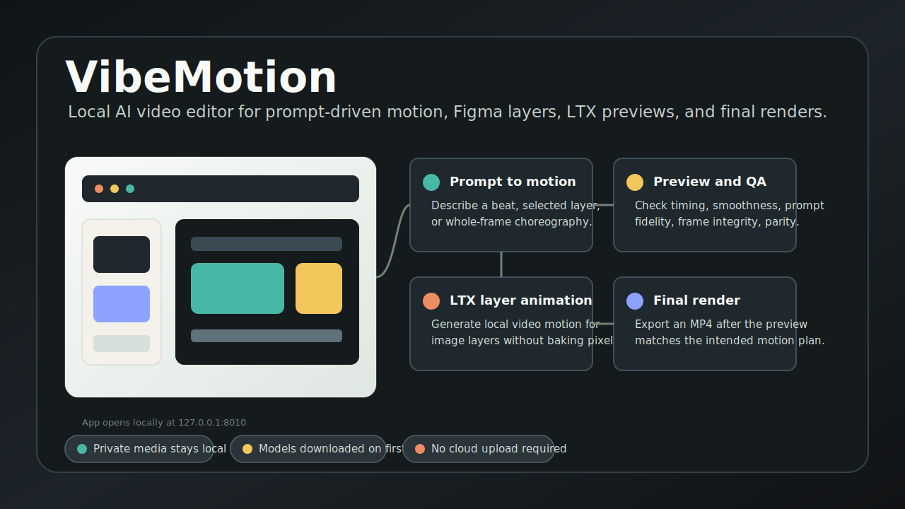
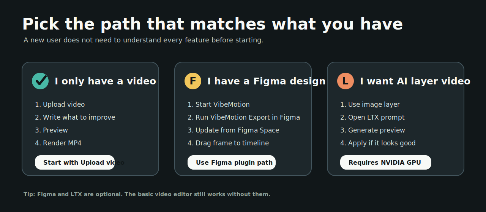
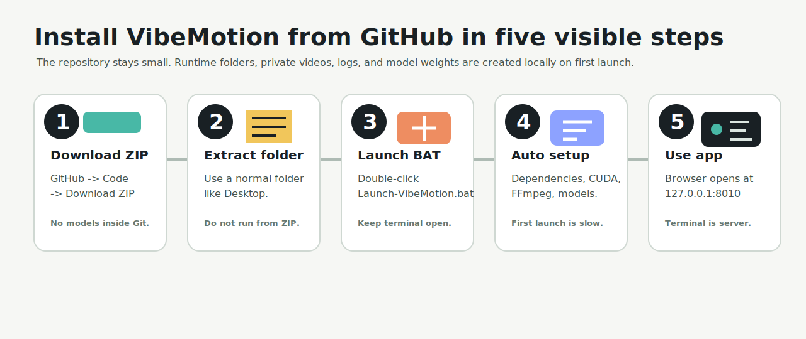
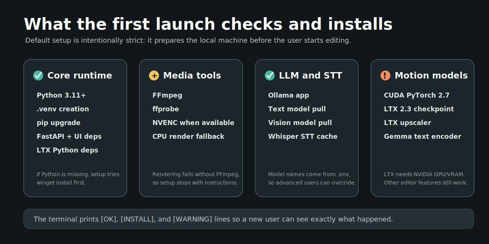
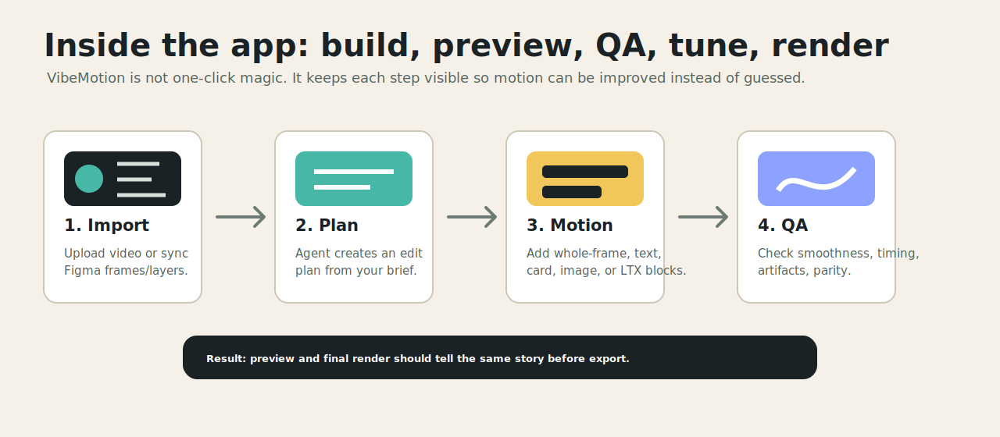
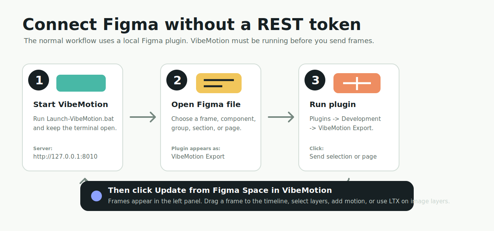

# VibeMotion v0.1.0 pre-alpha

> **Project status: pre-alpha / experimental local build.** VibeMotion is under
> active development. Some workflows can be unstable, UI and API behavior may
> change, and AI/LTX output quality depends heavily on the local machine,
> installed models, GPU/VRAM, and source media. Use copies of important videos
> and projects while testing.

Local AI-assisted video editor for prompt-driven motion, Figma layers, LTX
previews, and final MP4 renders.

<p align="center">
  
</p>

VibeMotion runs on your own Windows machine. Your videos, projects, generated
renders, model weights, tokens, logs, and QA artifacts stay local and are not
part of the GitHub repository.

## Start Here

If you are not a developer, use only this section first.

1. Download the ZIP from GitHub.
2. Extract it into a normal folder.
3. Double-click `Launch-VibeMotion.bat`.
4. Keep the terminal open, even if it looks busy.
5. Wait until the browser opens.
6. Upload a video or connect Figma.

You do not need Git, VS Code, Python knowledge, or terminal commands for normal
use. The first launch prepares the local machine for you.

Expected first launch:

| What you see | What it means |
| --- | --- |
| A terminal window opens | This is normal. It is the local setup and server. |
| Many install/download lines appear | This is normal on the first launch. |
| `[OK]` lines appear | That part is ready. |
| `[INSTALL]` lines appear | Something missing is being installed. |
| `[WARNING]` about CUDA/VRAM appears | LTX may not work, but the main editor can still run. |
| Browser opens at `127.0.0.1:8010` | VibeMotion is ready to use. |

## Choose Your Path

<p align="center">
  
</p>

Use the simplest path that matches your material:

| You have | Start with | Figma needed? | GPU needed? |
| --- | --- | --- | --- |
| A normal video | `Upload video` | No | No |
| A Figma design | `VibeMotion Export` plugin, then `Update from Figma Space` | Yes | No |
| An image layer you want to animate as video | `Animate with LTX 2.3` | Usually yes | Yes, NVIDIA recommended |

The product is built around a visible editing loop:

1. Import a video or Figma frame.
2. Create an edit plan from a prompt.
3. Add motion blocks for the full frame or selected layers.
4. Preview the result.
5. Run visual QA and tune the motion.
6. Render the final MP4.

## Install From GitHub

<p align="center">
  
</p>

Use this path when you downloaded the repository as a ZIP from GitHub.

1. Click the green `Code` button on GitHub.
2. Click `Download ZIP`.
3. Extract the ZIP into a normal folder, for example `Desktop\VibeMotion`.
4. Open the extracted folder.
5. Double-click `Launch-VibeMotion.bat`.
6. Keep the terminal open. The first launch can take a long time.
7. When setup is complete, the app opens at
   [http://127.0.0.1:8010/app/index.html](http://127.0.0.1:8010/app/index.html).

Do not run the app directly from inside the ZIP file. Extract it first, otherwise
Windows cannot create `.venv`, `models/`, `projects/`, and other local runtime
folders correctly.

Before you start, make sure you have:

| Requirement | Why it matters |
| --- | --- |
| Windows 10/11 | The launch scripts are Windows `.bat`/PowerShell scripts. |
| Internet on first launch | Dependencies and models may need to download. |
| Free disk space | LTX/Gemma model files are large. Keep plenty of free space. |
| Windows App Installer / `winget` | Used for automatic Python, FFmpeg, and Ollama installs when they are missing. |
| NVIDIA GPU | Only required for LTX generation. Basic editing works without it. |
| Figma Desktop | Only required if you want Figma import. |

## What First Launch Does

<p align="center">
  
</p>

`Launch-VibeMotion.bat` runs `scripts\bootstrap.ps1` before starting the server.
The bootstrap is designed for a fresh Windows PC and checks or installs the
things VibeMotion needs:

- Python 3.11+ and the local `.venv`.
- Python packages from `pyproject.toml`, including FastAPI, faster-whisper, and
  LTX-related packages.
- CUDA PyTorch pinned for the LTX runtime.
- FFmpeg and ffprobe for rendering and video analysis.
- Ollama, then the text and vision models from `.env`.
- faster-whisper STT model cache.
- The local Figma plugin registration.
- LTX 2.3 checkpoint, spatial upscaler, and Gemma text encoder files in
  `models/ltx-2.3/`.

The terminal prints clear `[OK]`, `[INSTALL]`, and `[WARNING]` lines. If a
dependency is already installed, it is reused. If a model file is missing, setup
downloads it. If something cannot be installed automatically, setup stops with a
message explaining what to fix and which launcher to run again.

Automatic system installs use Windows `winget`. If `winget` is not available,
install the missing item manually from the official source named in the terminal
message, reopen the terminal, and run `Launch-VibeMotion.bat` again. Python
packages, Whisper cache, Ollama models, and LTX model files are still handled by
the bootstrap script after the required system tools exist.

The first launch is expected to be slow because model downloads are large. Later
launches reuse `.venv` and `models/`.

How to know setup finished:

1. The terminal reaches `Server logs:`.
2. The browser opens.
3. The app shows the VibeMotion interface.

If it seems stuck, check whether the terminal is downloading a large model. Do
not close it during the first setup unless an error message appears.

## Using The App

<p align="center">
  
</p>

The browser is only the UI. The terminal window is the local server. Leave the
terminal open while editing. Closing the browser tab does not stop VibeMotion.

Basic flow:

1. Upload a video in the right project panel.
2. Import or sync Figma frames if you want layer-based design motion.
3. Use the agent brief to build an edit plan.
4. Add a motion block on the timeline or a selected layer.
5. Preview the motion.
6. Use redo/tune when the motion is not strong enough.
7. Render the final MP4.

What to click first:

| Goal | Click this first |
| --- | --- |
| Edit a talking-head video | `Upload video` |
| Bring in Figma frames | `Update from Figma Space` after running the Figma plugin |
| Ask the agent for an edit | Write a brief, then click `Plan agent edit` |
| Create another version | `New variant` |
| Build the planned result | `Build planned edit` |
| Animate a selected Figma image layer with LTX | `Animate with LTX 2.3` on that layer |

LTX is for local image-layer video motion. It requires an NVIDIA GPU with enough
free VRAM. If CUDA or VRAM is not available, the normal editor, timeline, Figma
import, prompt motion, and non-LTX rendering can still be used.

## Connect Figma

<p align="center">
  
</p>

The normal Figma connection does not need a Figma REST token. VibeMotion uses a
local plugin named `VibeMotion Export`.

First launch registers the plugin automatically. The setup writes the plugin
entry into your local Figma settings file and points it to `figma-plugin/` in
this repository.

Step-by-step:

1. Start VibeMotion with `Launch-VibeMotion.bat`.
2. Keep the terminal open until the app is available at
   `http://127.0.0.1:8010/app/index.html`.
3. Open your design file in Figma Desktop.
4. In Figma, open `Plugins` -> `Development` -> `VibeMotion Export`.
5. In the plugin window, leave the server field as `http://127.0.0.1:8010`.
6. Select a frame/component/group/section and click `Send selection to VibeMotion`,
   or click `Send page to VibeMotion` to export the current page.
7. Go back to VibeMotion and click `Update from Figma Space`.
8. Imported frames appear in the left Figma panel. Drag a frame into the timeline
   or select individual layers for prompt motion/LTX.

If the plugin does not appear in Figma:

1. Close Figma.
2. Run `Launch-VibeMotion.bat` again so setup can re-register the plugin.
3. Reopen Figma Desktop.
4. Check `Plugins` -> `Development`.

Manual plugin install fallback:

1. In Figma Desktop, open `Plugins` -> `Development` -> `Import plugin from manifest`.
2. Select `figma-plugin/manifest.json` from this repository.
3. Run `VibeMotion Export`.

The advanced `FIGMA_ACCESS_TOKEN` path is optional. It is only for future/manual
REST workflows. Keep tokens in `.env` or OS environment variables and never
commit them.

## Common Questions

**Do I need Figma?**
No. VibeMotion can work with a normal uploaded video. Figma is only for importing
design frames and editable layers.

**Do I need an NVIDIA GPU?**
Only for LTX video generation. The regular editor, Figma import, timeline,
prompt motion, and final rendering can still work without LTX.

**Can I close the terminal?**
No, not while using the app. The terminal is the local server. Close it only when
you want to stop VibeMotion.

**Where are my videos and renders?**
Local project data stays under ignored runtime folders such as `projects/` and
`output/`. Those files are not meant to be pushed to GitHub.

**Why is first launch slow?**
It may install Python packages and download local models. Later launches reuse
the installed files.

**What if Windows blocks the BAT file?**
Use the visible launcher `Launch-VibeMotion-Visible.bat` so you can read the
error. If Windows SmartScreen warns about a downloaded script, review the file
path and only run it if it came from the repository you trust.

**What if Figma does not show the plugin?**
Close Figma, run `Launch-VibeMotion.bat` again, reopen Figma, then check
`Plugins` -> `Development` -> `VibeMotion Export`.

## Files You Run

| File | Purpose |
| --- | --- |
| `Launch-VibeMotion.bat` | Normal user launcher. Runs setup, starts the server, opens the browser. |
| `Launch-VibeMotion-Visible.bat` | Debug launcher. Keeps server logs visible for troubleshooting. |
| `Stop-VibeMotion.bat` | Stops local VibeMotion server processes. |
| `scripts\bootstrap.ps1` | First-run dependency and model setup. |
| `scripts\audit_publication.py` | Scans publishable files for common secrets and local absolute paths. |

## Runtime Folders

These folders are created locally and are ignored by Git:

| Folder | What it contains |
| --- | --- |
| `.venv/` | Local Python environment. |
| `models/` | Downloaded LTX/Gemma/other model files. |
| `projects/` | User project state and local imported media references. |
| `output/` | Rendered MP4 files and generated media. |
| `qa_artifacts/` | Screenshots, contact sheets, logs, and QA reports. |
| `.secrets/` | Local tokens such as Hugging Face access tokens. |
| `vendor/` | Local third-party checkouts used for research, not publication. |

Keep those folders out of GitHub. The repository should contain source code,
docs, launcher scripts, QA scripts, and placeholders like `projects/.gitkeep`.

## Developer Run

For manual development without the launcher:

```powershell
python -m venv .venv
.\.venv\Scripts\Activate.ps1
pip install -e ".[ltx]"
copy .env.example .env
uvicorn app.main:app --host 127.0.0.1 --port 8010 --reload
```

Open:

```text
http://127.0.0.1:8010/app/index.html
```

To check the installer script without downloading large models:

```powershell
powershell -NoProfile -ExecutionPolicy Bypass -File scripts\bootstrap.ps1 -SkipModels -SkipOllama -SkipWhisper
```

## Repository Hygiene

Before publishing or pushing:

```powershell
python scripts\audit_publication.py
git status --short --ignored=matching
```

The audit checks for common API tokens, Figma tokens, Hugging Face tokens, and
local absolute paths in publishable source files. It is also wired into GitHub
Actions at `.github/workflows/publication-audit.yml`.

## License

VibeMotion source code is licensed under Apache-2.0. See [LICENSE](LICENSE),
[NOTICE.md](NOTICE.md), [THIRD_PARTY_NOTICES.md](THIRD_PARTY_NOTICES.md), and
[docs/license_review.md](docs/license_review.md).

Model weights are not included in this repository. LTX, Gemma, Ollama,
Whisper/faster-whisper, FFmpeg, GSAP, and other upstream projects remain subject
to their own licenses and terms.

## Upstream Repositories And Model Pages

These are the main external repositories, packages, model pages, and runtime
projects VibeMotion uses, integrates with, or was inspired by. This is not a
claim that their code or model weights are included in this repository.

| Area | Upstream |
| --- | --- |
| Motion/video workflow reference | [heygen-com/hyperframes](https://github.com/heygen-com/hyperframes) |
| Video editing workflow reference | [browser-use/video-use](https://github.com/browser-use/video-use) |
| LTX model/package family | [Lightricks/LTX-2](https://github.com/Lightricks/LTX-2) |
| LTX 2.3 model weights | [Lightricks/LTX-2.3 on Hugging Face](https://huggingface.co/Lightricks/LTX-2.3) |
| Gemma text encoder terms/model family | [Google Gemma terms](https://ai.google.dev/gemma/terms), [google/gemma-3-12b-it-qat-q4_0-unquantized](https://huggingface.co/google/gemma-3-12b-it-qat-q4_0-unquantized) |
| Public Gemma/LTX model pack fallback | [DeepBeepMeep/LTX-2](https://huggingface.co/DeepBeepMeep/LTX-2) |
| Local LLM runtime | [ollama/ollama](https://github.com/ollama/ollama) |
| Backend framework | [fastapi/fastapi](https://github.com/fastapi/fastapi), [encode/uvicorn](https://github.com/encode/uvicorn) |
| Local transcription | [SYSTRAN/faster-whisper](https://github.com/SYSTRAN/faster-whisper) |
| ML/runtime libraries | [pytorch/pytorch](https://github.com/pytorch/pytorch), [pytorch/vision](https://github.com/pytorch/vision), [pytorch/audio](https://github.com/pytorch/audio) |
| Hugging Face libraries | [huggingface/diffusers](https://github.com/huggingface/diffusers), [huggingface/transformers](https://github.com/huggingface/transformers), [huggingface/accelerate](https://github.com/huggingface/accelerate), [huggingface/safetensors](https://github.com/huggingface/safetensors) |
| Tokenizer/runtime helpers | [google/sentencepiece](https://github.com/google/sentencepiece), [python-pillow/Pillow](https://github.com/python-pillow/Pillow) |
| Media tools | [FFmpeg/FFmpeg](https://github.com/FFmpeg/FFmpeg) |
| Animation runtime used by generated previews | [greensock/GSAP](https://github.com/greensock/GSAP) |

For licensing details, read [THIRD_PARTY_NOTICES.md](THIRD_PARTY_NOTICES.md) and
[docs/license_review.md](docs/license_review.md) before public or commercial
distribution.
